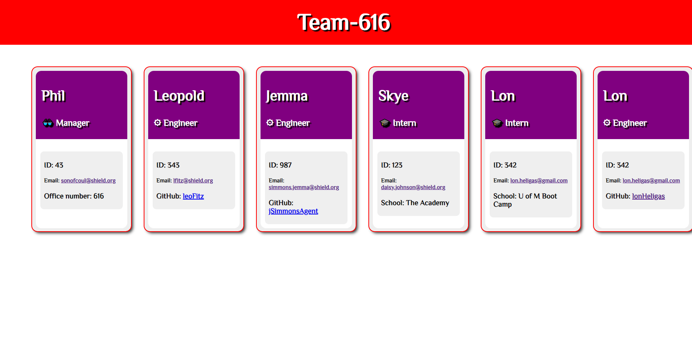

# Profile Creator For Your Team

[This is the repository for this challenge](https://github.com/lonHeligas/profile-creator-for-your-team)

Video of the Readme Generator working:
[Video:](https://drive.google.com/file/d/1F65TeohNY2Z1aRuMPLkfy_m8fzwoY-re/view?usp=sharing)




## Challenges I encountered

Classes. Classes and test-based development. But once I figured them out, it wasn't as difficult as I'd have thought it would be.
Piecing the team together was tricky as well, but after I re-worked it with my tutor, I think it came out nice.

## Your Task

Your task is to build a Node.js command-line application that takes in information about employees on a software engineering team, then generates an HTML webpage that displays summaries for each person. 

Because this Challenge will require the use of the `Inquirer` package, ensure that you install and use Inquirer version 8.2.4. To do so, use the following command in your project folder: `npm i inquirer@8.2.4`.

Testing is key to making code maintainable, so you’ll also write a unit test for every part of your code and ensure that it passes each test.

Because this application won’t be deployed, you’ll need to provide a link to a walkthrough video that demonstrates its functionality and all of the tests passing. You’ll need to submit a link to the video AND add it to the readme of your project.

## User Story

```
AS A developer
I WANT a README generator
SO THAT I can quickly create a professional README for a new project
```

## Acceptance Criteria

```
GIVEN a command-line application that accepts user input
WHEN I am prompted for information about my application repository
THEN a high-quality, professional README.md is generated with the title of my project and sections entitled Description, Table of Contents, Installation, Usage, License, Contributing, Tests, and Questions
WHEN I enter my project title
THEN this is displayed as the title of the README
WHEN I enter a description, installation instructions, usage information, contribution guidelines, and test instructions
THEN this information is added to the sections of the README entitled Description, Installation, Usage, Contributing, and Tests
WHEN I choose a license for my application from a list of options
THEN a badge for that license is added near the top of the README and a notice is added to the section of the README entitled License that explains which license the application is covered under
WHEN I enter my GitHub username
THEN this is added to the section of the README entitled Questions, with a link to my GitHub profile
WHEN I enter my email address
THEN this is added to the section of the README entitled Questions, with instructions on how to reach me with additional questions
WHEN I click on the links in the Table of Contents
THEN I am taken to the corresponding section of the README

